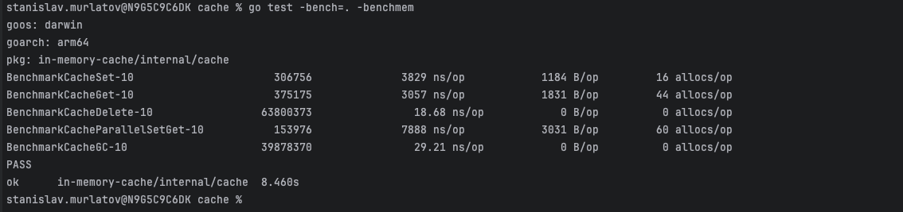

# In-Memory thread-safe cache

## Task description

The goal is to write an in-memory cache that will return a profile and a list of orders by key (user UUID).

The cache should have a TTL (Time to Live) of 2 seconds.
The cache should be accessible by functions that handle orders (adding/updating/deleting). If the TTL has expired, it should return nil. When updating, the TTL should be reset to 2 seconds. The methods must be thread-safe.
Automatic cleanup of expired records.

## Banchmarks

